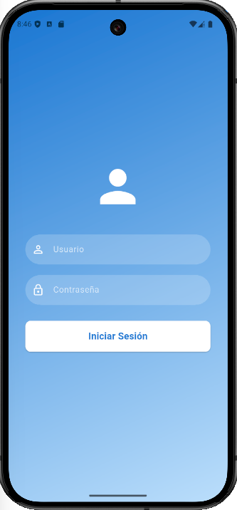
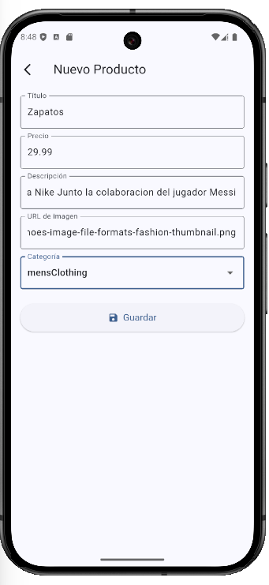
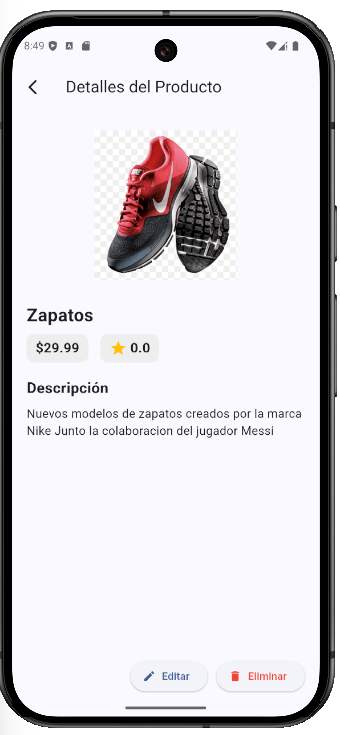
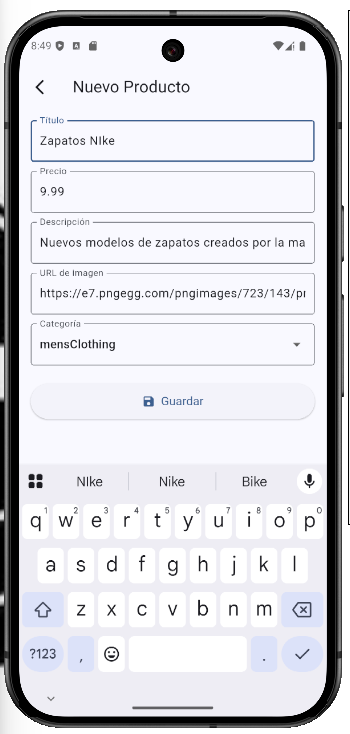
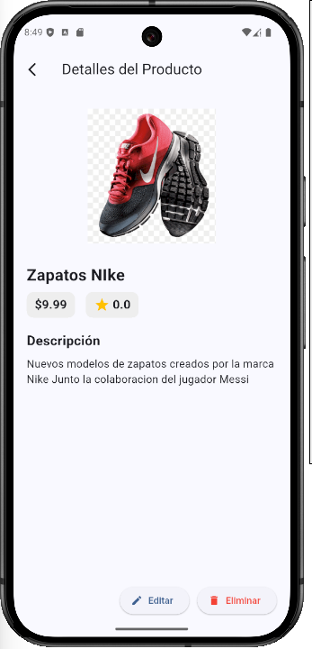
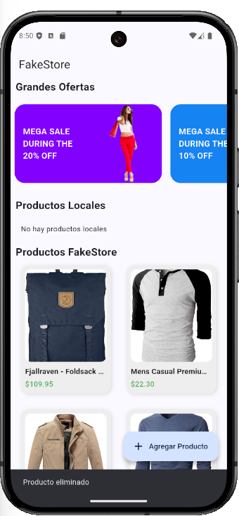
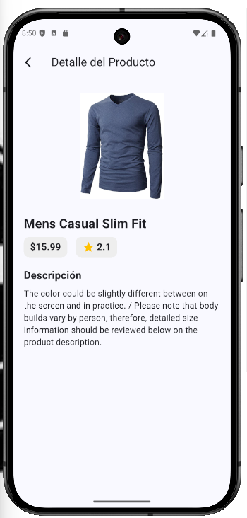

# 📱 FakeStore - Prueba Técnica en Flutter

Este proyecto es una aplicación móvil desarrollada en Flutter como parte de una prueba técnica. La app simula una tienda en línea donde los usuarios pueden iniciar sesión y gestionar productos mediante un CRUD (Crear, Leer, Actualizar, Eliminar). Además, consume datos de la API pública [FakeStore API](https://fakestoreapi.com/) para mostrar productos reales.

---

## 🚀 Características principales

- 🔐 Login con datos parametrizados desde un archivo local (`usuarios.json`)
- 📦 Listado de productos desde:
  - API externa (fakestoreapi.com)
  - Productos creados localmente por el usuario
- ➕ Crear nuevos productos locales
- 🔄 Editar productos locales
- 🗑️ Eliminar productos locales
- 🔍 Ver detalles de cualquier producto

---

## 🧰 Tecnologías y paquetes utilizados

- Flutter SDK: `^3.7.2`
- [Dio](https://pub.dev/packages/dio) – para consumo de API
- [Flutter Riverpod](https://riverpod.dev/) – para manejo de estado
- [Go Router](https://pub.dev/packages/go_router) – para navegación
- [Riverpod Generator & Annotation](https://pub.dev/packages/riverpod_generator) – generación de providers

### 📁 Dependencias del `pubspec.yaml`:

```yaml
dependencies:
  dio: ^5.8.0+1
  flutter:
    sdk: flutter
  flutter_riverpod: ^2.6.1
  go_router: ^15.1.1
  riverpod_annotation: ^2.6.1


## 🗂️ Estructura del proyecto

```bash
prueba_tecnica/
├── assets/
│   ├── usuarios.json        # Usuarios para login
│   └── images/              # Imágenes de prueba
├── lib/
│   ├── main.dart            # Punto de entrada
│   ├── config/              # Manejo de ruta y theme
│   ├── datasources/         # Conexión a la API
│   ├── model/               # Modelos de datos
│   ├── presentation/        # Pantallas principales
│   ├── providers/           # Providers de Riverpod
│   └── repositories/        # Repositorios de datos
├── screenshots/             # Capturas de pantalla del funcionamiento
└── pubspec.yaml
```

---

## ▶️ ¿Cómo ejecutar el proyecto?

1. Clona este repositorio
   ```bash
   git clone https://github.com/tu-usuario/prueba_tecnica.git
   cd prueba_tecnica
   ```

2. Instala dependencias
   ```bash
   flutter pub get
   ```

3. Ejecuta la app
   ```bash
   flutter run
   ```

> Asegúrate de tener un dispositivo/emulador Android o iOS corriendo.

---

## 👤 Login de prueba

Los datos de acceso están en `assets/usuarios.json`. Puedes modificar o agregar más usuarios si lo deseas.

Ejemplo:
```json
[
  {
    "usuario": "admin",
    "clave": "1234"
  }
]
```

## 🖼️ Capturas de pantalla

### 1. Pantalla de Login


### 2. Home con Productos (API y locales)


### 3. Crear Producto


### 4. Home con Producto creado localmente


### 5. Detalle del Producto creado


### 6. Editar Producto


### 7. Detalle del Producto actualizado


### 8. Eliminación del producto con Snackbar


### 9. Detalle de Producto de la API

